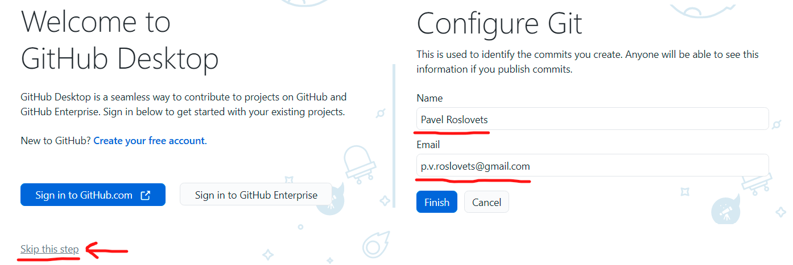
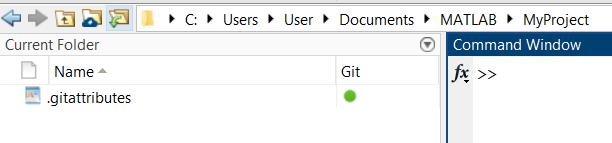
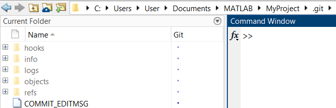
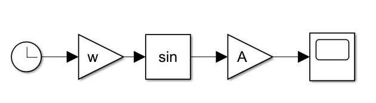
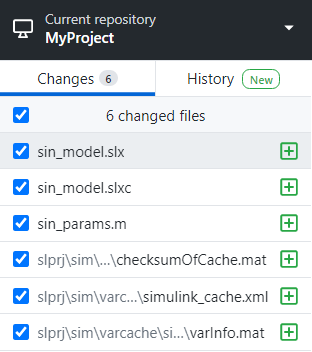
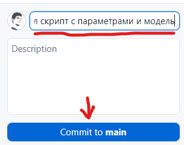
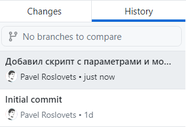
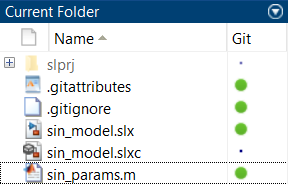
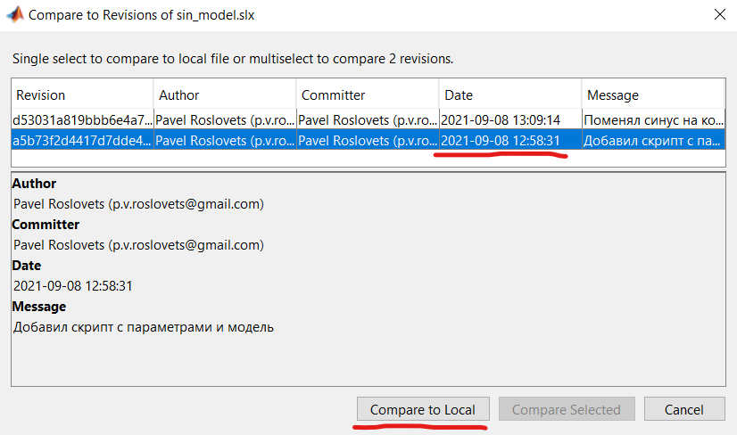
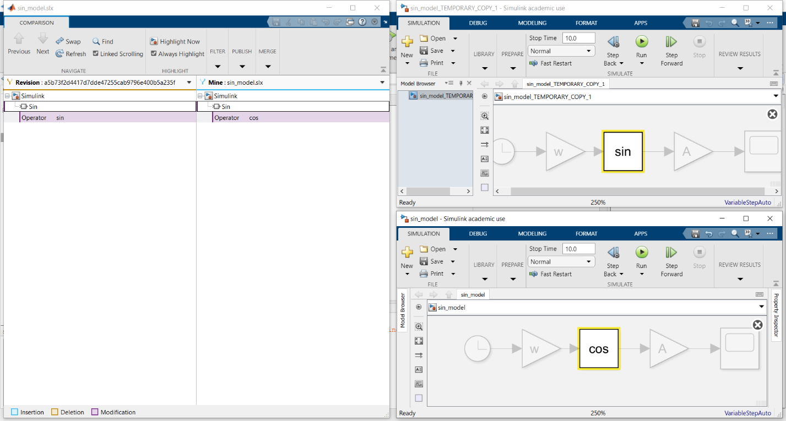

# MATLAB + Git: как управлять изменениями скриптов и моделей Simulink без бардака и боли

- [Статья на Хабре](https://habr.com/ru/company/etmc_exponenta/blog/578172/)
- [Скачать файлы занятия](https://github.com/roslovets/MATLAB-Git-Demo/archive/refs/heads/main.zip)

___

Все мы знаем, что среда MATLAB заточена под людей, которые не
обязательно являются профессиональными программистами, – математиков,
инженеров, аналитиков и даже студентов.

С одной стороны, это большой плюс – люди просто решают свою прикладные
задачи без заморочек с выбором библиотек, архитектурой ПО и прочим ООП.

С другой стороны, часто можно наблюдать, что, находясь в песочнице
Матлаба, люди оказываются оторваны от мира «большого программирования»
со своими устоявшимися подходами и инструментами.

Понятно, что не всем условным математикам нравится глубоко в это все
погружаться. Но при этом мне очень досадно наблюдать, как суровые
инженеры, которые программируют микроконтроллеры для самонаводящихся
ракет, не могут даже настроить систему контроля версий, не говоря уже об
автоматизированном тестировании и прочих девопсах.

В этой статье я хочу показать инженерам, как можно без боли
контролировать изменения скриптов MATLAB и моделей Simulink. А также
попытаюсь донести матлаберам, не знакомым с системой контроля версий (а
таких большинство), что для них это *необходимый инструмент на каждый
день*.

Чтобы не потерять вас в самом начале, привожу краткую серию ответов на
вопросы, которые мне часто задают новички в этой теме.

**Что такое «система контроля версий»?**

Это отдельная бесплатная программа, которая работает вместе с MATLAB и
сохраняет всю историю того, что вы изменяли в своем проекте: какой
добавляли код, как изменяли настройки модели и т. д.

Самая популярная и мощная называется **Git**, сегодня будем говорить о
ней.

**Зачем она мне нужна?**

Чтобы ваш проект не выглядел так


*Бардак и боль*

Намного комфортнее хранить старые версии моделей и кода где-то в
*истории изменений*, чем в куче в одной папке. Ведь вы на следующий же
день забываете, какой именно файл актуальный и почему нельзя удалять
старые. Контроль версий – самый удобный способ превратить проект из
помойки во что-то понятное и приятное.

**Круто. И все?**

Нет, не все. Только с системой контроля версий вы сможете нормально
работать над одним проектом всей командой. Вы имеете полную историю
изменений всех файлов проекта. Вы видите кто, когда и что конкретно
изменил.

А еще без этого вы в принципе не сможете полноценно автоматизировать
тестирование и использовать прочие прелести из мира DevOps.

Наконец, работа с системой контроля версий – это один из самых базовых
и необходимых навыков, если вы захотите перейти в IT-отрасль или
серьезную зарубежную компанию.

А для студентов, которые наше все, это вообще мастхэв ­– стыдно не
владеть Гитом в 2021.

**Ладно, попробую. Это сложно?**

Не очень, за вечер можно освоить базу. Если вы совсем не знаете, что
такое Git, то уйдет пара вечеров. Хорошая новость­ – в Гугле и на Ютубе
вы найдете тонны материалов, где все объясняют на пальцах.

**Предупреждение**

Когда вы более-менее освоитесь с контролем версий и Git, то **по-другому
вы не сможете и на захотите работать в принципе**. При создании каждого
нового проекта вы первым делом будете добавлять его в Git. Вы перетащите
все старые проекты в Git. Вы научите коллег работать в Git. Вы будете
вспоминать старые времена как свои темные века.

Я сам все это проходил. И многие коллеги проходили. Поэтому я и пишу об
этом так уверенно.

Итак, я постарался максимально вас мотивировать, чтобы вы смогли
преодолеть тот небольшой порог, с которым сейчас столкнетесь. К делу.

## **Установка GitHub Desktop**

Предположим, что MATLAB у вас уже установлен. Осталось научить его
контролю версий с помощью Git.

И если вы еще не в курсе, то знайте, что сам Git – это консольная
утилита, то есть работать с ним нужно из черного окна терминала. Поэтому
все уроки по Гиту, что вы найдете в интернете, изобилуют разными
командами.

Хорошая новость в том, что сегодня мы писать команды не будем и
обойдемся исключительно возможностями Матлаба и еще одного специального
приложения с функционалом Git.

Этого вам хватит, чтобы войти в тему и освоить самые базовые принципы
контроля версий. Ну а продолжив освоение, вы в любом случае установите
[Git](https://git-scm.com/downloads) и освоите парочку команд, без этого
никуда.

А пока что мы скачаем так называемый Git GUI-клиент. Подобных приложений
создано десятки, если не сотни. Их задача – позволить вам работать с
Гитом быстро и удобно с помощью мышки и без командной строки.

Моим любимым Git-приложением является GitHub Desktop. Оно сильно
упрощает работу с Гитом и делает ее приятной рутиной. Оно красивое,
удобное и без излишеств. Я пользуюсь им буквально каждый день и вам
советую.

Честно говоря, я сомневаюсь, что до сих пор остались люди, которые
работают с Гитом на десктопе исключительно из командной строки (а если и
есть, то они меня пугают ).

Скачиваем GitHub Desktop с [официального
сайта](https://desktop.github.com/) и устанавливаем. Для начала
пропускаем этап, связанный с созданием аккаунта, а затем вводим свое имя
и почту (эти данные нужны для Гита и **никуда не передаются**, пока вы
сами не захотите).



Итак, у нас установлены MATLAB и GitHub Desktop. Пора внедрить контроль
версий в наш проект.

## **Создание репозитория**

Repository переводится как «хранилище». В Гите репозиторием называется
папка, в которой хранится ваш проект (код, модели, данные...) **плюс**
полная история изменений всех файлов проекта.

Давайте сначала создадим пустой Git-репозиторий, а затем перенесем в
него проект. Для создания нового репо используем GitHub Desktop.
Выбираем **File -\> New Repository...** и затем обязательно вводим
название новой папки проекта *MyProject*, а также указываем путь
родительской папки, в которой будет создана папка проекта (например,
папка *Документы\\MATLAB*):


Открываем созданную папку в Матлабе и видим там какой-то непонятный файл
*.gitattributes*:



Это служебный файл Гита, который для нас создал GitHub Desktop. Подобные
файлы используют, чтобы тонко настроить репозиторий и то, как Гит с ним
работает. В нашем случае .gitattributes не особо нужен, но трогать его
не будем, чтобы не запутаться.

Тут у вас возникает вопрос: а что тогда делает нашу обычную пустую папку
*MyProject* Гит-репозиторием, который будет хранить все изменения?

Ответ: наличие скрытой директории *.git*, которая также автоматом
создалась в нашей папке. Именно в ней и будет храниться вся история
изменений. Лазить в эту папку лишний раз не стоит, менять в ней что-то
вручную нельзя, удалять – тем более, потеряете всю историю. Просто
знайте, что она существует и делает всю работу, хоть вы ее и не видите:



*Мы ее не видим, а она есть, только вы ее не трогайте*

Дальнейшие действия вы можете выполнять для любого своего проекта
MATLAB/Simulink. Просто выберите проект и скопируйте все его файлы в
*MyProject*.

Я же для наглядности создам простейший проект с нуля, чтобы не отвлекать
вас от сути.

Для начала создаем простейший скрипт *sin_params.m*, допустим, с
параметрами модели:

```MATLAB
A = 10;
w = pi / 2;
```

И простейшую Симулинк-модель *sin_model.slx*:



Скачать скрипт и модель вы можете по
[**ссылке**](https://github.com/roslovets/MATLAB-Git-Demo/archive/refs/heads/main.zip).

Итак, мы имеем не что иное, как локальный репозиторий Git с нашим
проектом. Осталось добавить ему истории!

## **Учёт изменений**

Теперь посмотрим, как вы будете работать с Git каждый день.

Переходим в GitHub Desktop, в котором уже открыта наша папка с проектом.
Это приложение скорее всего будет запущено у вас постоянно вместе с
Матлабом.

Мы видим, что изменилось в вашем проекте – добавилось аж 6 новых
файлов! При этом полезных из них только два – скрипт и модель,
остальные файлы временные, их создал Симулинк для ускорения симуляции.



*Новые файлы в репозитории*

Примем простое правило: всякие временные и прочие левые файлы в историю
изменений добавлять не надо. Добавляйте только те файлы, которые вы
разрабатываете. А чтобы остальные не мешались, сразу добавим их в игнор
Гита. Для этого выберем в меню **Repository -\> Repository
settings...**, в окошке выбираем Ignored files и вводим в текстовое поле
следующее:

```
slprj
*.slxc
```

Теперь Гит не будет обращать внимания на всю папку slprj и файлы с
расширением slxc. А в списке добавленных файлов мы видим скрипт, модель
и новый файл *.gitignore*, в котором и хранится список игнорируемых
файлов.

Теперь давайте зафиксируем наши изменения проекта в истории. Как вы
видите в списке, из изменений у нас – создание трех новых файлов.

В терминологии Гита фиксация любых изменений называется «коммит»
(commit). Поэтому вместо «зафиксировать изменения» будем говорить просто
«закоммитить», привыкайте.

Итак, галочками уже отмечены изменения, которые хотим закоммитить.
Осталось придумать им ёмкое описание. Например, напишем: «Добавил скрипт
с параметрами и модель». Что писать и на каком языке – решайте сами.
Только помните, что названия коммитов помогут и пригодятся вам в
будущем, потому не пишите откровенную ерунду.



*Описание коммита при желании тоже можете добавить*

После этого жмём кнопку **Commit** и тем самым сохраняем наши изменения
в истории. На сами файлы проекта это никак не влияет. Просто изменения
сохранены куда-то в недра в папки .git.

Теперь полюбуемся нашим коммитом в истории изменений на вкладке
**Commits**. Вы можете посмотреть название коммита и что конкретно было
изменено. Такое исследование истории никак не влияет на файлы проекта и
не изменяет их. Считайте, что вы просто читаете логи.



*Первый Initial commit создал GitHub Desktop при создании репозитория*

Кстати, обратите внимание, что, когда Матлаб понимает, что в текущей
папке есть контроль версий, он цветными иконками показывает статус
файлов по сравнению с последним коммитом (не изменён, изменён, удален,
конфликтует и т. д.). Это одна из фич интеграции MATLAB и Git:



*Если вы измените файл, иконка поменяется*

Теперь поменяем параметры в нашем скрипте:

```MATLAB
A = 10;
w = pi / 4;
```

А в модели поменяем sin на cos. Не забываем сохранить.


*Можете внести еще пару любых изменений*

Одна из стратегий работы с Гитом (которой не обязательно придерживаться)
– делать отдельный коммит на каждое изменение. Так и поступим. Сначала
пометим галочкой и закоммитим изменение скрипта, потом также поступим с
моделью. История стала интереснее:


## **Анализ изменений**

Теперь посмотрим, как Гит позволяет вспомнить, какие конкретно изменения
были когда-то внесены в наш репозиторий.

Для этого выделим коммит, в котором мы меняли параметры, и приложение
тут же показывает нам, что конкретно в этом текстовом файле поменялось:


А вот с моделью Симулинк это полноценно не сработает, потому что файл
бинарный и Гит не может его расшифровать. Зато Матлаб сможет. В Матлабе
кликаем правой кнопкой на модели в окне *Current Folder* и в меню
выбираем **Source Control -> Compare to Revision**. Выбираем один из
старых коммитов и жмем **Compare to Local**.



Открывается инструмент анализа изменений Simulink-модели. Все изменения
показаны в дереве, и вы тут же можете посмотреть, как модель выглядела
до и после изменения:



## **Заключение**

Я думаю, этого пока достаточно. Мы рассмотрели самые-самые основы Git,
чтобы вы просто могли начать. За кадром остались такие важные вопросы,
как откат к старым версиям, отправка репозитория на сервер для
совместной работы и не только.

Мы поговорим о них следующих статьях, если эта тема вам зайдет. Так что
не стесняйтесь задавать вопросы в комментариях к [статье](https://habr.com/ru/company/etmc_exponenta/blog/578172/), делиться опытом и
ставить плюсики. Спасибо за прочтение.
